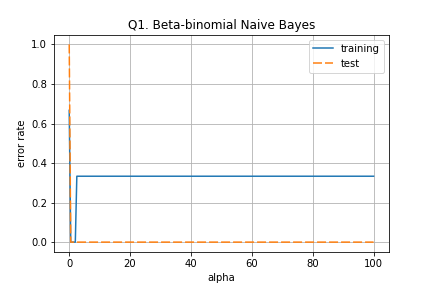
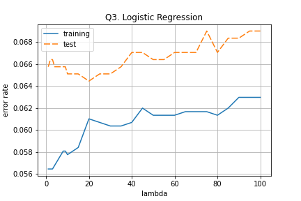
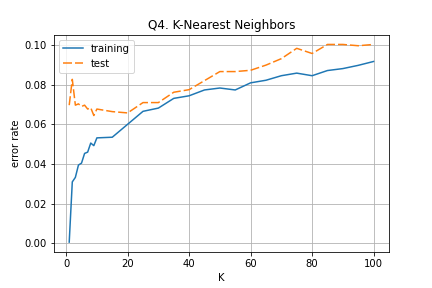

# email-spam

## EE5907/EE5027 Programming Assignment CA1

> by: SUN Shuo 
> email: shuo.sun@nus.edu.sg

### Prerequisites
The packages I used here are very simple:
* python >= 3.6
* scipy
* numpy
* matplotlib
* tqdm 

### Installation
I am using `conda` environment so you can directly install the environment from file:
```bash
conda create --name pr --file requirements.txt
```
or 
```bash
pip install -r requirements.txt
```

### Usage

Please refer to the code in `analysis.ipynb`

- You may just run the code blocks all the way till the end

Data is saved in `data/`

Resulted Figures are saved in `pics/`

### Results
#### Q1. Beta-Binomial Naive Bayes Classifier


#### Q3. Logistic Classifier


#### Q4. K-NN Classifier

